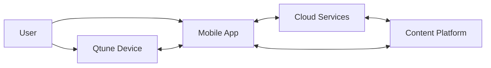

# Qtune 系统架构

## 1. 系统目标

Qtune 的系统架构需要同时支撑三条主链路：

- `实时交互链路`：用户触碰投影界面并即时获得声音和视觉反馈
- `创作管理链路`：用户在 App 中编辑布局、配置模式并同步到设备
- `内容传播链路`：用户录制作品、上传平台并在社区中被消费和分发

## 2. 系统组成

Qtune 系统由四个核心部分构成：

1. `设备端`
2. `移动 App`
3. `云端服务`
4. `内容/社区平台`

## 3. 子系统边界

### 3.1 设备端

负责：

- 投影交互界面
- 感知触碰和动作
- 执行本地音频反馈
- 接收 App 下发的布局和配置

不负责：

- 社区内容分发
- 重型视频处理
- 长期内容存储

### 3.2 移动 App

负责：

- 设备连接、校准和配置
- 模式选择和界面编辑
- 录制、预览、分享和同步
- 用户账户与内容入口

### 3.3 云端服务

负责：

- 账户认证
- 内容元数据管理
- 模板、谱面和作品同步
- 平台运营配置和推荐支持

### 3.4 内容/社区平台

负责：

- 作品展示和消费
- 模板与谱面分发
- 社区互动
- 创作者运营和平台治理

## 4. 核心数据对象

- `DeviceProfile`：设备标识、固件版本、能力集和校准信息
- `CanvasTemplate`：控制界面模板及其元件定义
- `Chart`：节奏谱面与挑战内容
- `Performance`：演奏记录、音频和视频素材
- `ProjectSession`：用户一次创作会话的配置和状态
- `UserAccount`：账户资料、作品、收藏和设备绑定关系

## 5. 核心链路

### 5.1 校准链路

1. 用户启动设备
2. 设备投出校准界面并检测表面条件
3. App 获取设备状态并展示校准结果
4. 校准参数写回设备配置并保存到用户账户

### 5.2 演奏链路

1. 用户选择模式或模板
2. App 下发当前模式配置到设备
3. 设备投影对应界面并进入感应状态
4. 用户触发交互区域
5. 设备完成识别、反馈和音频输出

### 5.3 编辑链路

1. 用户在 App 中创建或编辑界面模板
2. App 将模板结构序列化并预览
3. 模板同步至设备用于实时投影
4. 模板保存到云端用于后续复用或分享

### 5.4 录制与分享链路

1. 用户在 App 中发起录制
2. App 采集设备状态、音频和相机画面
3. 生成 `Performance`
4. 用户选择发布到社区或导出到外部平台

### 5.5 内容分发链路

1. 创作者上传模板、谱面或作品
2. 平台服务生成元数据并进入审核或运营流程
3. 内容进入推荐流、专题页或搜索结果
4. 用户浏览、互动、收藏并再次使用

## 6. 架构约束

- `低延迟优先`：演奏链路优先本地闭环，不依赖云端实时参与
- `设备轻平台重`：复杂编辑和内容管理能力尽量放在 App 和云端
- `模板可移植`：布局、谱面和作品需要跨设备、跨会话复用
- `模式可扩展`：新模式应复用已有设备能力和内容对象

## 7. 主要风险

- 设备端实时性和 App 端复杂功能之间的能力分配不当
- 模板、谱面和作品三类内容的边界不清导致数据模型膨胀
- 社区平台过早扩张，反向拖慢 `V1.0` 核心体验

因此 `V1.0` 的系统设计应优先保证：设备可用、App 可配置、内容可分享，再逐步扩大平台深度。
